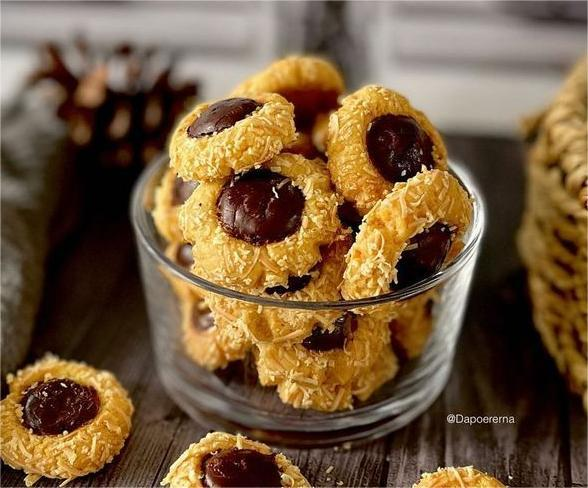
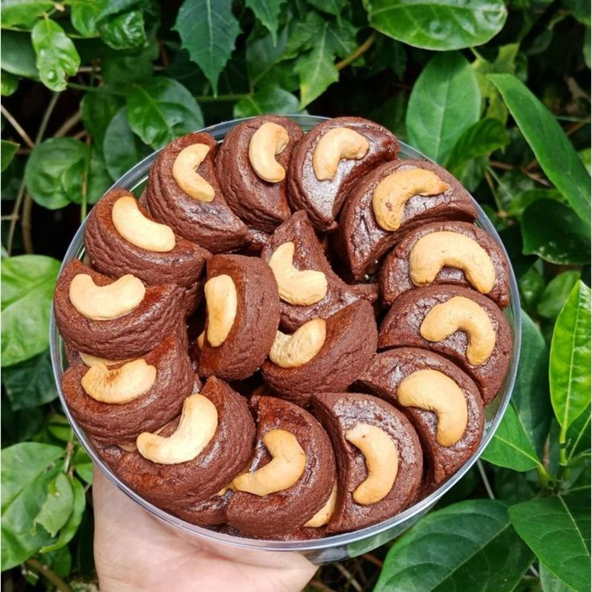
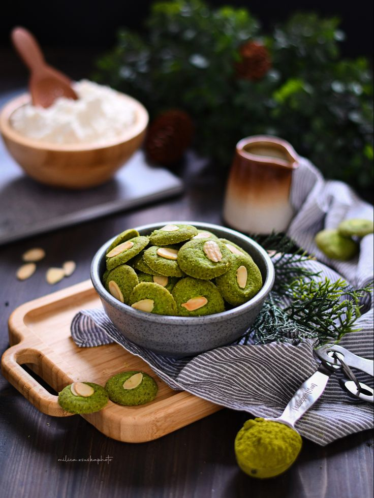
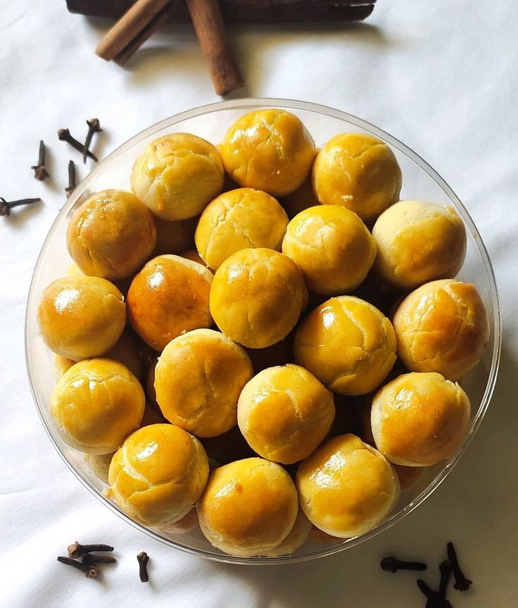

<!DOCTYPE html>
<html lang="en">
<head>
    <meta charset="UTF-8">
    <meta name="viewport" content="width=device-width, initial-scale=1.0">
    <title>Homepage Jualan Kue</title>
    <link rel="stylesheet" href="styles.css">
    
</head>
<body>
    <header>
        <h1>Selamat Datang di Toko Kue Kami</h1>
        
Kue Lezat untuk Setiap Kesempatan

    </header>
        
    <nav>
        <ul>
            <li><a href="#home">Home</a></li>
            <li><a href="#about">Tentang Kami</a></li>
            <li><a href="produk.html">Produk</a></li>
        </ul>
    </nav>

    <section id="home">
        
        <h2>Berbagai Pilihan Kue yang Menggugah Selera</h2>
        
Temukan kue favorit Anda di sini!

    </section>

    <section id="about">
        <h2>Tentang Kami</h2>
        
Kami adalah toko kue yang menyediakan berbagai jenis kue buatan rumah dengan kualitas terbaik.

    </section>

    <section id="products">
        <h2>Produk Kami</h2>
        

            
            <h3>Kue Kering Nutella</h3>
            
Rp. 50.000

            <button onclick="sendToWhatsApp('Kue Kering Nutella', 'Rp50,000')">Pesan via WhatsApp</button>
        

        

            
            <h3>Kue Kering Coklat Mede</h3>
            
Rp. 60.000

            <button onclick="sendToWhatsApp('Kue Coklat Mede', 'Rp60,000')">Pesan via WhatsApp</button>
        

        

            
            <h3>Kue Matcha Almond</h3>
            
Rp. 60.000

             <button onclick="sendToWhatsApp('Kue Matcha', 'Rp60,000')">Pesan via WhatsApp</button>
        

        

            
            <h3>Kue Nastar</h3>
            
Rp. 70.000

             <button onclick="sendToWhatsApp('Kue Kering Nutella', 'Rp50,000')">Pesan via WhatsApp</button>
        

        

            
            <h3>Berbagai Macam Dessert Pencuci Mulut</h3>
            
Rp. 75.000

             <button onclick="sendToWhatsApp('Dessert', 'Rp75,000')">Pesan via WhatsApp</button>
        

        <!-- Tambahkan lebih banyak produk di sini -->
    </section>

</section>
    
    <footer>
        
&copy; 2024 Toko Kue. All rights reserved.

    </footer>
    
</body>
</html>
